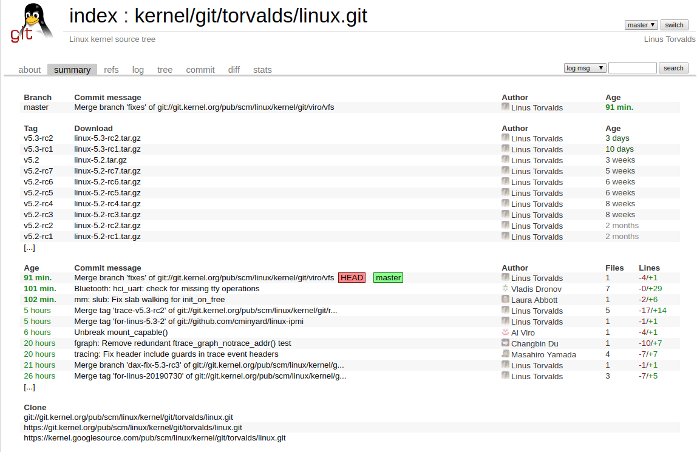
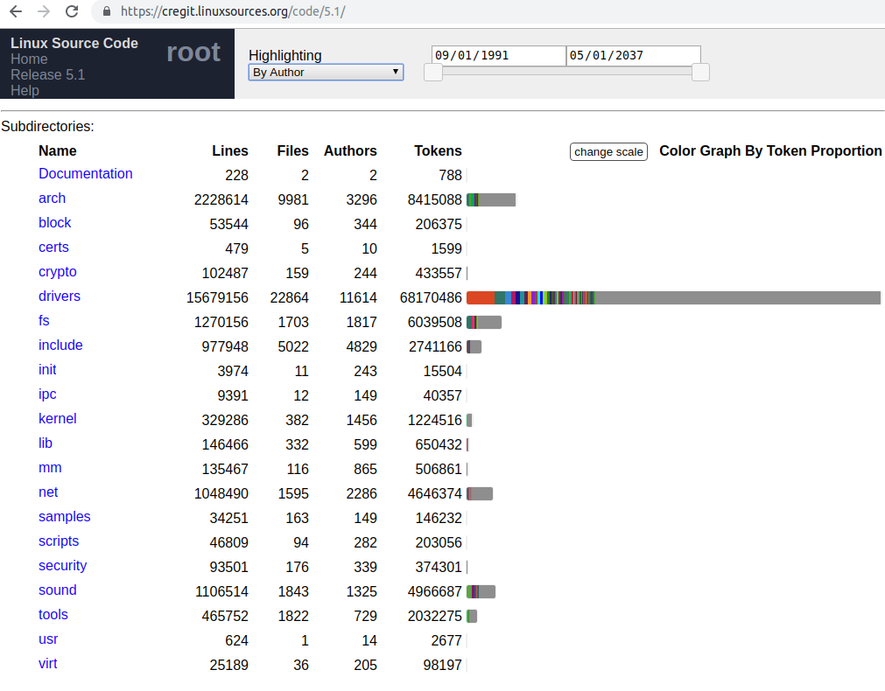
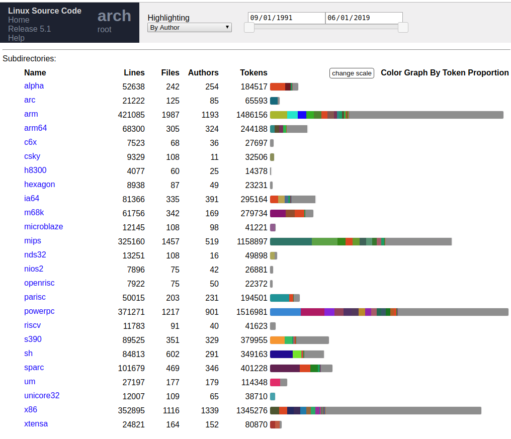
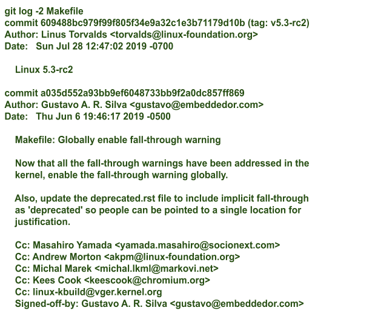
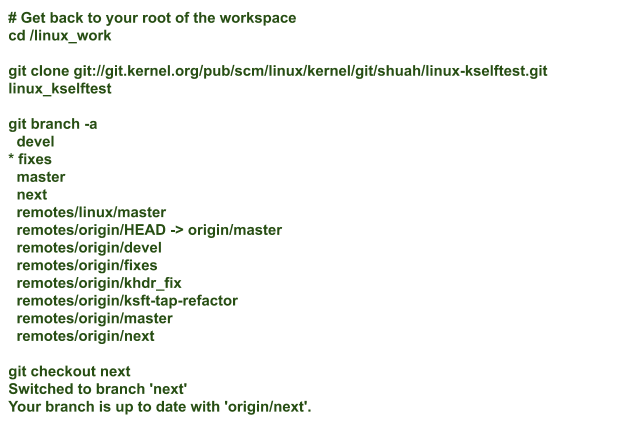

# Introduction to Exploring Linux Kernel Sources

We are getting closer to writing kernel code, but there are still some details that we need to take care of first. This file will look at the kernel sources to get a feel for subsystems and major kernel areas.

## Learning Objectives : 
By the end of this, you should be able to : 
    - Clone the mainline kernel tree
    - Review how the kernel source is structured.
    - Explore the source history using the [cregit](https://github.com/cregit/cregit) tool.

## Linux Mainline

We talked about Linux kernel repositories and where they are hosted. It is time to check out the mainline kernel to explore the sources. We prefer creating a separate workspace(not under the home directory) for our upstream work to explore git repositories. Let's walk through checking out kernel sources in your newly created workspace. In the following examples, we are using __linux_work__ as the root of the workspace. 

You can find information on the latest stable and mainline releases on [The Linux Kernel Archives](https://www.kernel.org/) web page. Let's start by cloning Linus's tree, which is called the [Linux mainline](https://git.kernel.org/pub/scm/linux/kernel/git/torvalds/linux.git/), to explore the kernel sources. The screenshot below shows the main branch and how to clone it. 



## Cloning the Linux Mainline

Next, let's clone the Linux mainline. The mainline cloning step will create a new directory named __linux_mainline__ and populate it with sources.

```bash
cd /linux_work
git clone git://git.kernel.org/pub/scm/linux/kernel/git/torvalds/linux.git linux_mainline
cd linux_mainline; ls -h
```

```bash
arch     CREDITS        fs        ipc      lib          mm      samples   tools
block    crypto         include   Kbuild   LICENSES     net     scripts   usr
certs    Documentation  init      Kconfig  MAINTAINERS  README  security  virt
COPYING  drivers        io_uring  kernel   Makefile     rust    sound
```

Directories are color-coded `green`, while files are in `black` in the output above.

## What is in the Root Directory?

Let's take a look at what's in the root directory. This screenshot presents a view of the Linux 5.1 release on [cregit-linux](https://cregit.linuxsources.org/). Cregit was created by [Daniel German](http://turingmachine.org/) from the University of Victoria in Canada, Alexandre Courouble and [Bram Adams](http://mcis.polymtl.ca/bram.html) from the Polytechnique of Montreal in Canada, and Kate Stewart from the Linux Foundation.



As you can see, the bulk of the kernel code lives under the __drivers__ subdirectory.

Let's take a peek at this screenshot and see how many architectures are supported by Linux.



## Exploring the Sources

We encourage you to explore the sources. Take a look at the __Makefile__ and __MAINTAINERS__ files in the main directory, `scripts/get_maintainer.pl`, and `scripts/checkpatch.pl`. You will use them in your everyday kernel development life.

Play with `cregit` or `git log` to look at the histroy of source files in each of the kernel areas. You can look at individual commits and generate a patch or two using 

```bash 
git format-patch -i <commit ID>
```
as shown in the example presented in this screenshot : 



You can generate a patch for 
`a035d552a93bb9ef6048733bb9f2a0dc857ff869` and take a look at the changes made by this commit

```bash
git format-patch -1 a035d552a93bb9ef6048733bb9f2a0dc857ff869
```

## Exploring the linux-kselftest Repository

Before building and installing the kernel, let's look at the `linux-kselftest` repository and check the branches underneath it.




---

