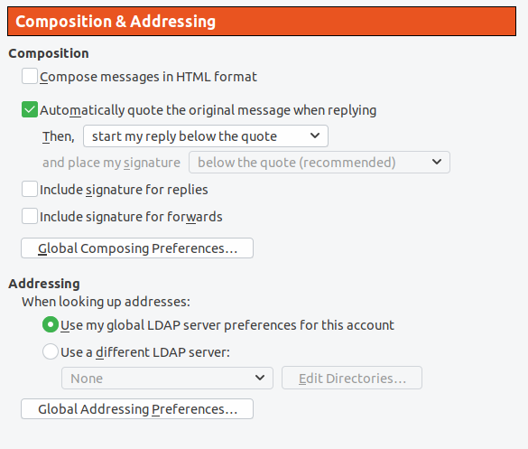

# Email Client Configuration

You still need to configure your email client to send responses, to review comments, and other communication with the community.

## Things to Remember

1. Bottom post 
	Never top post in your response. Top posting is writing a message above the original text while responding to an email. Add your reponses at the bottom of the original text. Bottom posting makes reading and following review comments on a patch easier.

2. Inline post
	When reviewing or responding to a patch, deleting or stripping parts of the messages you are not replying to is a good practice, and makes it easier to follow the responses in the thread.

3. No HTML format 
	Disable compose message in HTML format. Patches sent using HTML format will be automatically rejected by the development mailing lists.

4. No signatures 
	Do not include private information in your signature. This is important for privacy reasons, as you will be posting to mailing lists.

5. No attachments 
	Do not send patches as attachments.
	Ingeneral, avoid attachments. Some exceptions are kernel logs or configuration files when reporting bugs.

You should refer to [Email clients for Linux](https://www.kernel.org/doc/html/latest/process/email-clients.html) for more details.

You must generate an app-specific password for authentication if you have 2-factor on your Gmail account. Please refer to the Examples in [this document](https://git-scm.com/docs/git-send-email) for more information.

Here is an example Thunderbird configuration screen that shows the above selections.

