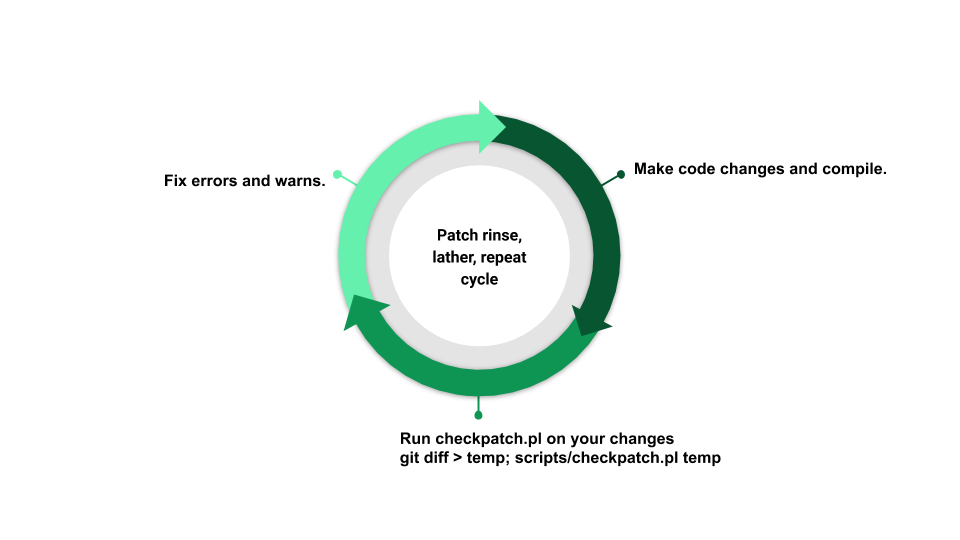

# Introduction to Writing Your First Kernel Patch

By the end of this document, you should be able to : 
    - Make a kernel change
    - Test your patch
    - Commit your change and generate your patch
    - Validation if your patch meets coding style guidelines.

## Creating a User-Specific Git configuration file

Let's start by configuring global git options, and then you can go to cloning the kernel repository.

Create a user-specific Git configuration the file named `.gitconfig` in your home directory with your name, email and other needed configuration. This information is used for commits and patch generation.

> Refer to /git-email.md for details

## Kernel Configuration

Let's work with the mainline kernel to create your first patch. By this time, if you have completed the exercise from the previous chapters. you should already have the mainline kernel running on your system. While doing that, we asked you to copy the distribution configuration file to generate the kernel configuration. Now, let's talk about the kernel configuration.

The Linux kernel is enirely configurable. Drivers can be configured to be installed and completely disabled. Here are three options for driver installation : 
    - Disabled
    - Built into the kernel (__vmlinux__ image) to be loaded at boot time
    - Built as a module to be loaded as needed using __modprobe__

To avoid large kernel images, it is a good idea to configure drivers as modules. Modules (__.ko__ files) can be loaded when the kernel detects hardware that matches the driver. Building drivers as modules allows them to be loaded on demand, instead of keeping them around in the kernel image even when the hardware is either not being used, or not even present on the system.

We discussed generating the new configuration with old one as the starting point. New releases often introduce new configuration variables and, in some cases, rename the configuration symbols. The latter causes problems, and `make oldconfig` might not generate a new working kernel.

Run `make listnewconfig` after copying the configuration from `/boot` to `.config` file, to see a list of new configuration symbols. [Kconfig make config](https://www.kernel.org/doc/html/latest/kbuild/kconfig.html) is a good source about __Kconfig__ and __make config__. Please refer to the [Kernel Build System](https://www.kernel.org/doc/html/latest/kbuild/index.html) to understand the kernel build framework and the kernel makefiles.


## Creating a New Branch

Before making a change, let's create a new branch in the `linux_mainline` repository you cloned earlier to write your first patch. We will start by adding a remote first to do a __rebase__ (pick up changes made to the mainline).

```bash
cd linux_mainline
git branch -a
* master
  remotes/linux/master
  remotes/origin?HEAD -> origin/master
  remotes/origin/master
```

## Adding a Remote 

Let's add [git://git.kernel.org/pub/scm/linux/kernel/git/torvalds/linux.git](git://git.kernel.org/pub/scm/linux/kernel/git/torvalds/linux.git) as the remote named __linux__. Adding a remote helps us fetch changes and choose a tag to rebase from.

```bash
git remote add linux git://git.kernel.org/pub/scm/linux/kernel/git/torvalds/linux.git
git fetch linux
remote: Counting objects: 3976, done.
remote: Compressing objects: 100% (1988/1988), done.
remote: Total 3976 (delta 2458), reused 2608 (delta 1969)
Receiving objects: 100% (3976/3976), 6.67 MiB | 7.80 MiB/s, done.
Resolving deltas: 100% (2458/2458), done.
From git://git.kernel.org/pub/scm/linux/kernel/git/torvalds/linux
   2a11c76e5301..ecb095bff5d4   master -> linux/master
 * [new tag]                  v5.x-rc3 -> v5.x-rc3

```

We can pick a tag to rebase to. In this case, there is only one new tag. Let's hold off on the rebase and start writing a new patch.

## Checkout the Branch 

To check out a branch, run : 

```bash
git checkout -b work
master
* work
  remotes/linux/master
  remotes/origin/HEAD -> origin/master
  remotes/origin/master
```

## Making Changes to a Driver 

Now, let's select a driver to make a change. Run __lsmod__ to see the modules loaded on your system, and pick a driver to change. We will walk you through changing the `uvcvideo` driver. If you don't have `uvcvideo` on your system, find a different driver and follow along using <i>your driver name</i> instead of __uvcvideo__.

Once you have a driver's name, it's time to find out where the `.c` and `.h` files for that driver are in the Linux kernel repository. Even though searching __Makefiles__ will get you the desired result, `git grep` wil get you there faster, searching only the checked-in files in the repository. `git grep` will skip all generated files such as `.o`'s, `.ko`'sand binaries. It will skip the `.git` directory as well. Okay, now let's run `git grep` to look for `uvcvideo` files.

```bash
git grep uvcvideo -- '*Makefile'
drivers/media/usb/uvc/Makefile:uvcvideo-objs := uvc_driver.o uvc_queue.o uvc_v4l2.o uvc_video.o uvc_ctrl.o drivers/media/usb/uvc/Makefile:uvcvideo-objs += uvc_entity.o
drivers/media/usb/uvc/Makefile:obj-$(CONFIG_USB_VIDEO_CLASS) += uvcvideo.o
```
__uvcvideo__ is a USB Video Class(UVC) media driver for video Input devices, such as webcams. It supports webcams  on laptops. Let's check the source files for this driver.

```bash
ls drivers/media/usb/uvc/
Kconfig uvc_debugfs.c uvc_isight.c uvc_status.c uvcvideo.h
Makefile uvc_driver.c uvc_metadata.c uvc_v4l2.c
uvc_ctrl.c uvc_entity.c uvc_queue.c uvc_video.c
```

Let's make a small change to the probe function of the __uvcvideo__ driver. A probe function is called when driver is loaded. Let's edit __uvc_driver.c__ : 

```bash
vim drivers/media/usb/uvc/uvc_driver.c
```

Find the probe function by searching for <b>_probe</b> text by typing `/` in standard mode. Once you've found the probe function, add `pr_info()` to it save the file. A `pr_info()` function writes a messages to the kernel log buffer, and we can see it using `dmseg`.

```c
static int uvc_probe(struct usb_interface *intf,
                     const struct usb_device_id *id)
{
        struct usb_device *udev = interface_to_usbdev(intf);
        struct uvc_device *dev;
        const struct uvc_device_info *info =
                (const struct uvc_device_info *)id->driver_info;
        int function;
        int ret;

        pr_info("I changed uvcvideo driver in the Linux Kernel\n");

        if (id->idVendor && id->idProduct)
                uvc_trace(UVC_TRACE_PROBE, "Probing known UVC device %s "
                                "(%04x:%04x)\n", udev->devpath, id->idVendor,
                                id->idProduct);
        else
                uvc_trace(UVC_TRACE_PROBE, "Probing generic UVC device %s\n",
                                udev->devpath);​

```

Let’s try configuring uvcvideo as a built-in and as a module to play with installing, loading and unloading modules.

Configure as a module:

    - Configure CONFIG_USB_VIDEO_CLASS=m
    - Recompile your kernel and install. Please note that you don't have to reboot your system. You can load your newly installed module.

Load module:

    - `sudo modprobe uvcvideo`
    - Once you load the module, let's check if you see your message.
    - Run dmesg | less and search for "I changed". Do you see the message?
    - Run lsmod | grep uvcvideo. Do you see the module?

Unload module:

    - `sudo rmmod uvcvideo`
    - Check dmesg for any messages about the uvcvideo module removal.
    - Run lsmod | grep uvcvideo. Do you see the module?

Configure Built-in:

    - Configure <b>CONFIG_USB_VIDEO_CLASS=y</b>
    - Recompile your kernel, install, and reboot the system into the newly installed kernel.
    - Run <b>dmesg | less</b> and search for <b>"I changed"</b>. Do you see the message?

## Practing Commits

Let's practice commiting a change. You can see the files you modified by running the `git status` command. Let's first check if your changes follow the coding guidelines outlined in the [Linux kernel coding style guide](https://www.kernel.org/doc/html/latest/process/coding-style.html). You can run [checkpatch.pl](https://git.kernel.org/pub/scm/linux/kernel/git/torvalds/linux.git/tree/scripts/checkpatch.pl) on the diff or the generated patch to verify if your changes comply with the coding style. It is good practice to check by running `checkpatch.pl` on the diff before testing and commiting the changes. We find it useful to do this step even before we start testing our patch. This helps avoid redoing testing in case code changes are necessary to address the __checkpatch__ errors and warnings. 

You can see my patch workflow below.



Address __checkpatch__ errors and/or warnings. Once __checkpatch__ is happy, test your changes and commit your changes. 

If you want to commit all modified files, run:

```bash
git commit -a
```

If you have changes that belong in seperate patches, run:

```bash
git commit <filename>
```

When you commit a patch, you will have to describe what the patch does. The commit message has a subject or short log and a longer commit message. Learning what should be in the commit log and what doesn't make sense is important. Including what code does isn't very helpful, whereas why the code change is needed is valuable. Please read [How to Write a Git Commit Message](https://chris.beams.io/posts/git-commit/) for tips on writing good commit messages.

Now, run the commit and add a commit message. After commiting the change, generate the patch by running the following command:

```bash
git format-patch -1 <commit ID>
